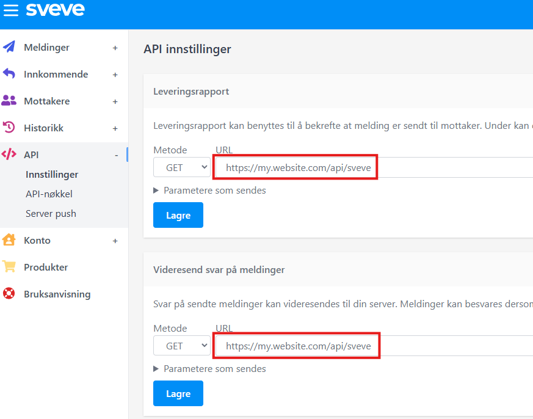

# Sveve.Net


A dotnet client written in C# for the REST-APIs provided by [Sveve](https://sveve.no/).  

> [!important]
> This is an unofficial library and not made by or supported by Sveve.

In this repository houses two packages.  
They can be used together or independently.  
- [Sveve](#sveve) Send sms
- [Sveve.AspNetCore](#sveve.aspnetcore) Receive messages and delivery reports from Sveve.  

# Sveve
Use the `Sveve` NuGet package to send SMS using the Sveve API.  
```cs
var client = new SveveClient("username", "password");
await client.SendAsync(new Sms("99999999", "Drink some water!"));
```
Naturally, you need an account at Sveve.

## ServiceCollection
You can create a `SveveClient` manually like shown above, but if you have a `IServiceCollection` available, it's recommended to use the extensions methods for that instead.
```cs
services.AddSveveClient(new SveveClientOptions 
{
    Username = "username",
    Password = "password"
});
```
This will automatically hook up dependencies like `ILogger` from your `IServiceProvider`.  

## Send
```cs
await client.SendAsync(new Sms("99999999", "Drink water!"));
```

Sveve imposes a limit of `5` concurrent requests per account.  Therefore, sometimes, it is usefull to batch requests. To do this, simply call `SveveClient.SendAsync` with multiple messages:
```cs
await client.SendAsync([
    new Sms("44444444", "Drink water!"), 
    new Sms("99999999", "You too!")]);
```

## Schedule
```cs
var sms = new Sms("+47 949 49 494", "A friendly reminder to drink water")
{
    SendTime = DateTimeOffset.Now.AddDays(1);
};
await client.SendAsync(sms);
```

## Repeat
Sveve supports repeating messages, but be carefull with this one.  
Use the `SendRepeat` class to specify a repetition:
```cs
var sms = new Sms("+47 999 99 999", "Am I annoying now?");

// Never repeat the sms. This is the default behaviour.
sms.Repeat = SendRepeat.Never;

// Send the sms once every hour and NEVER stop. ( Please dont )
sms.Repeat = SendRepeat.Hourly();

// Send the sms every two days until the sms has been sent three times.
sms.Repeat = SendRepeat.Daily(days:2).Times(3);

// Send the sms once every month for a year.
sms.Repeat = SendRepeat.Monthly().Until(DateTime.Now.AddYears(1));

await client.SendAsync(sms);
```

> [!caution]
> Be careful very careful when making repetitions that never end.  

## Replies
```cs
await client.SendAsync(new Sms("444 44 444", "Hello, how are you?")
{
    ReplyAllowed = true
});
```
This allows the receiver to reply to the sms.  
To handle the replies, see [Sveve.AspNetCore](#sveve.aspnetcore).

> [!note]
> If `ReplyAllowed` is `true` Sveve sends the sms from a randomly generated 14-digit phone number. This means that the display-senders configured in either `SveveClientOptions.Sender` or `Sms.Sender` are ignored.

If you have already sent a sms and want to send another to the same thread on the users phone:
```cs
// Send the first sms and keep the id.
var response = await client.SendAsync(new Sms("444 44 444", "Hello, how are you?")
{
    ReplyAllowed = true
});

// remember the sms id.
int messageId = response.MessageId("44  44444 4");

// Send another sms to the same conversation/thread on the users phone.
await client.SendAsync(new Sms("44444444", "Pleace don't ignore me :(")
{
    ReplyTo = messageId
});
```

When a user replies to your sms, Sveve can invoked a web-hook configured by you.  
To receive messages, see [Sveve.AspNetCore](#sveve.aspnetcore).

## Testing
Test-mode can be enabled for the entire client:
```cs
var client = new SveveClient(new SveveClientOption
{
    Username = "username",
    Password = "password",
    Test = true
});
```
Or for a single sms:
```cs
await client.SendAsync(new Sms("99999999", "Not actually sent") { Test = true });
```
Test messages are sent to Sveve, but not delivered to the receiver.

> [!warning]
> When sending messages in bulk, all messages must agree on `Sms.Test`.  
> Otherwise an `ArgumentException` is thrown.

> [!note]
> If `SveveClientOptions.Test` is `true`, `Sms.Test` is ignored.  
> All messages become test messages.

## Groups
Sveve allows you to manage named collections of recipients called groups.  
All the groups on your account can be listed with
```cs
var groupNames = await client.GroupsAsync();
```

To work with an individual group, use 
```cs
var group = client.Group("my-group");

// AddMemberAsync creates the group if it does not
// already exist.
await group.AddMemberAsync("99999999", name:"Some Member");

// Does nothing if the group does not exist
// or the member is not in the group.
await group.RemoveMemberAsync("44444444");

// Send sms to Some Member and every other member of my-group.
await client.SendAsync("my-group", "Hello!");
```

When you are done with a group, you can delete it using
```cs
// Does nothing if the group does not exist.
await group.DeleteAsync();
```
or move all the members from the original group to another group.
```cs
var myGroup = client.Group("my-group");

// another-group is created if it does not already exist.
await myGroup.MoveToAsync("another-group");

// my-group is now empty.
```

## Admin
To send messages from Sveve, you need sms units. Sms units are bought in advance. To check the remaining amount of sms units on your account call
```cs
var remaining = await client.RemainingSmsUnitsAsync();
```

If you need more sms units, you can buy them in fixed size bulks like this:
```cs
await client.PurchaseSmsUnitsAsync(SmsUnitOrder.Bulk500);
```

> [!caution]
> Calls to `PurchaseSmsUnitsAsync` will cost you real money billed to your account.

> [!tip]
> Bigger purchases cost you less per sms unit.

## Logs and metrics
The client produces logs and metrics all of which are prefixed by `Sveve`.

# Sveve.AspNetCore
If configured, Sveve will send you notifications when your messages are delivered, fail to deliver or when you receive an incoming sms.  
The `Sveve.AspNetCore` NuGet package helps you consume these notifications.  
While they work well together, you can use the `Sveve.AspNetCore` and the `Sveve` packages independently.

Before you can start consuming notifications from Sveve, you need to set up a few things:  

## Configure your API
In `Program.cs` register your consumers on the `IServiceCollection`. Consumers are registered using
```cs
// Consume delivery reports
builder.Services.AddSveveDeliveryConsumer<MyDeliveryConsumer>();

// Consume incoming messages
builder.Services.AddSveveSmsConsumer<MySmsConsumer>();

// Consume all Sveve notifications
builder.Services.AddSveveConsumer<MyConsumer>();
```
_Consumers are registered as transient by default_

After the app has been build, you must also add the endpoint Sveve will call when delivering notifications:
```cs
app.MapSveveConsumerEndpoint("api/sveve");
```

> [!tip]
> If no consumers are registered for a notification or any consumer throws during handling,  
> your API will return `500 Internal Server Error` and Sveve will try again later.


## Configure Sveve
Once your API is configured to consume notifications from Sveve, you need to tell Sveve where to deliver the reports.  

Grab the **full URL** to your Sveve consumer endpoint and head over to [Sveve](https://sveve.no) and sign in.  
Once there, add the consumer URL to all callbacks:


> [!tip] 
> You can also add the URL to callbacks for messages to dedicated phone numbers and code words.

## Delivery reports
When a sms sent by you has been delivered or failed to deliver, Sveve will notify you and all the registered `ISveveDeliveryConsumer`s will be invoked with the appropriate callback.

## Incoming messages
When someone sends you a message, Sveve will notify you and all the registered `ISveveSmsConsumer`s will be invoked with the appropriate callback.

Here is an example sms consumer.  
When a user replies to a sms, we reply to them with a joke made by some gpt model.
```cs
class MyConsumer(GptModel gpt, SveveClient sveve) : ISveveSmsConsumer
{
    public async Task SmsReceived(
        IncomingSmsReply sms, 
        CancellationToken cancellationToken)
    {
        var joke = await gpt.PromptAsync(
            "You are a very funny comedian who loves to make people laugh." +
            "Make a joke about this: " + sms.Message);
            
        var reply = new Sms(sms.SenderPhoneNumber, "Joke: " + joke)
        {
            // Ensure SMS is added to the same thread
            // as the message the user replied to:
            ReplyTo = sms.MessageId
        };
        
        await sveve.SendAsync(reply, cancellationToken);
    }
    
    public Task SmsReceived(
        IncomingSmsToCode sms,
        CancellationToken cancellationToken)
        => Task.CompletedTask;
    
    public Task SmsReceived(
        IncomingSmsToDedicatedPhoneNumber sms,
        CancellationToken cancellationToken)
        => Task.CompletedTask;
}
```


## Logs and metrics
The consumers produces logs and metrics all of which are prefixed by `Sveve`.

# Contributing
I am a full-time developer and a part-time student so contributions are most welcome.  
I strongly encourage you to make early pull-requests for more feedback.

# Preview builds
Are you really sure about this?  
To access the preview builds of the packages, add the NuGet source `https://nuget.pkg.github.com/MatsM16/index.json`.  
But before you do, please stop and consider the implications to your sanity.  
The preview versions are built at every push to `main` and are considered unstable at best.  